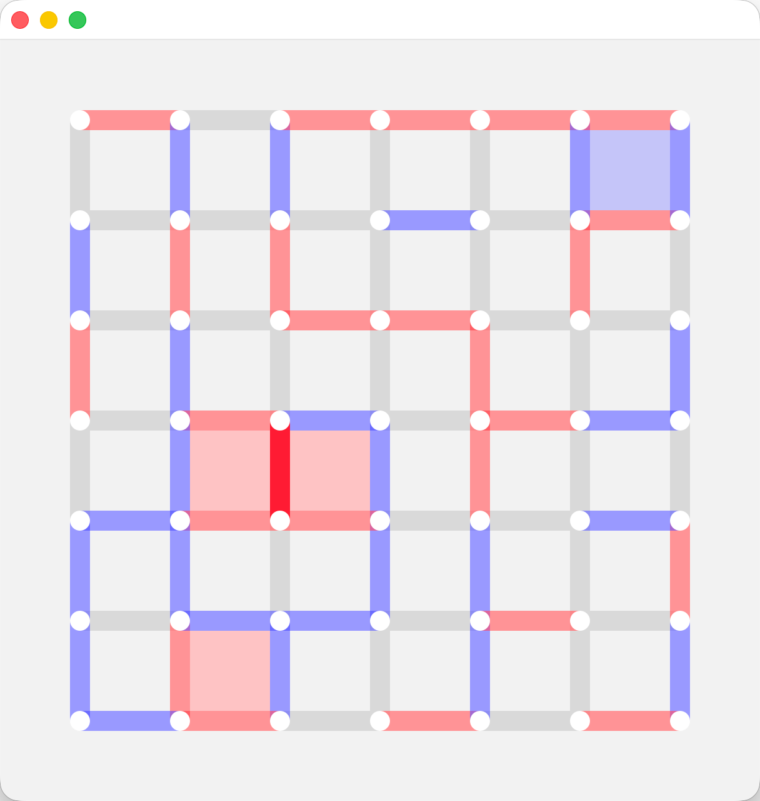

# Dots and Boxes

A modern implementation of the classic Dots and Boxes game with AI opponents, built with Qt6 and C++20.

<div align="center">
     
</div>

## Features

- **Interactive GUI**: Beautiful Qt6-based graphical interface with dark/light theme support
- **Human vs Human**: Play against a friend locally
- **Human vs AI**: Challenge AI opponents with varying difficulty levels
- **AI vs AI**: Watch AI players compete against each other
- **Multiple AI Levels**: Five different AI difficulty levels (L0-L4)
  - **L0**: Simple Strategy Robot
  - **L1**: Basic Search Robot
  - **L2**: Improved Search Robot
  - **L3**: MonteCarlo Search Robot
  - **L4**: Parallel Search Robot (most advanced)
- **Parallel Processing**: Utilizes OpenMP for efficient AI computations
- **Real-time Gameplay**: Visual feedback with highlighted moves and score tracking

## Requirements

- **CMake** 3.16 or higher
- **C++20** compatible compiler
- **Qt6** (Core, Gui, Widgets)
- **OpenMP** support

## Building

1. Clone the repository:

```bash
git clone <repository-url>
cd Dots-and-Boxes
```

2. Create a build directory:

```bash
mkdir build
cd build
```

3. Configure and build:

```bash
cmake ..
make
```

4. Run the executable:

```bash
./Dots_and_Boxes
```

## Usage

### Basic Usage

Run the game with default settings (AI vs AI, both L4):

```bash
./Dots_and_Boxes
```

### Command Line Options

```bash
./Dots_and_Boxes [OPTIONS]
```

**Options:**

- `--player1=TYPE` - Set player 1 type (`human` or `robot`, default: `robot`)
- `--player2=TYPE` - Set player 2 type (`human` or `robot`, default: `robot`)
- `--robot1=LEVEL` - Set robot 1 level (`L0`, `L1`, `L2`, `L3`, or `L4`, default: `L4`)
- `--robot2=LEVEL` - Set robot 2 level (`L0`, `L1`, `L2`, `L3`, or `L4`, default: `L4`)
- `--help`, `-h` - Show help message

### Examples

Play as human against an AI opponent:

```bash
./Dots_and_Boxes --player1=human --player2=robot --robot2=L2
```

Watch two AI opponents with different difficulty levels:

```bash
./Dots_and_Boxes --robot1=L1 --robot2=L4
```

Play against a friend:

```bash
./Dots_and_Boxes --player1=human --player2=human
```

## Game Rules

Dots and Boxes is a classic pencil-and-paper game:

1. Players take turns connecting adjacent dots with lines (edges)
2. When a player completes a box (square), they claim it and get a point
3. Completing a box gives the player another turn
4. The player with the most boxes at the end wins

## Project Structure

```
Dots-and-Boxes/
├── frontend/          # Qt GUI components
│   ├── canvases/      # Canvas widgets for rendering
│   └── layers/        # Layer components for game display
├── src/
│   ├── board/         # Board game logic
│   ├── common/        # Common utilities and data structures
│   ├── model/         # Game model (Edge, Box, Score, etc.)
│   └── robot/         # AI implementations
├── main.cpp           # Application entry point
└── CMakeLists.txt     # Build configuration
```

## AI Implementation

The project includes multiple AI strategies:

- **Simple Strategy Robot (L0)**: Basic heuristic-based moves
- **Basic Search Robot (L1)**: Minimax search with basic evaluation
- **Improved Search Robot (L2)**: Enhanced search with better heuristics
- **MonteCarlo Search Robot (L3)**: Monte Carlo tree search algorithm
- **Parallel Search Robot (L4)**: Parallelized search for optimal performance

## License

This project is licensed under the MIT License - see the [LICENSE](LICENSE) file for details.

## Contributing

Contributions are welcome! Please feel free to submit a Pull Request.
